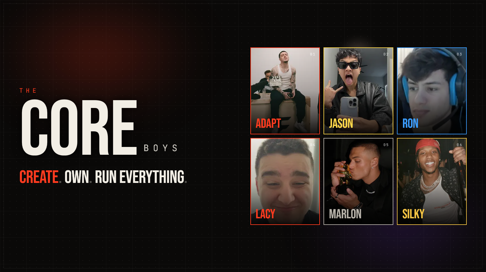

# coreboys-web

The public-facing landing page for **The Core Boys** — a six-person creator
group. This is a Next.js 15 / React 19 / Tailwind v4 site with a Three.js hero
scene, GSAP-driven manifesto reveal, and a live Twitch status integration.



> Tagline: **Create. Own. Run. Everything.**

## Stack

- Next.js 15 (App Router, Turbopack dev) · React 19
- Tailwind v4 with CSS-vars-based theming
- `@react-three/fiber` + `@react-three/drei` + `@react-three/postprocessing`
- Framer Motion (UI motion) + GSAP/ScrollTrigger (scroll choreography)
- Lenis smooth scroll
- Radix primitives (Dialog, Tabs) — restyled
- SWR for the Twitch live-status hook
- Zod for env + API validation
- pnpm

## Architecture

```
app/
  layout.tsx              fonts, metadata, Lenis + nuqs providers
  page.tsx                composes the seven sections
  globals.css             Tailwind v4 + CSS-var design tokens
  api/twitch/live/route.ts  Twitch Helix integration
components/
  sections/               HeroCore, Manifesto, Roster, LiveNow, HouseReveal, Crew, Footer
  three/                  CoreScene, CoreObject, OrbitNodes
  ui/                     Pill, Dialog, Tabs, MemberHex, MemberDialog, SocialIcon, LiveDot
  providers/LenisProvider.tsx
hooks/
  useLiveStatus.ts        SWR hook over /api/twitch/live, refreshes every 60s
  useReducedMotion.ts
lib/
  env.ts                  Zod-validated env (Twitch creds)
  twitch.ts               Helix client (app token cache + streams fetch)
  members.ts              Wraps @coreboys/shared with web-only extras (bio, twitchLogin, portrait, display order)
  utils.ts
scripts/sync-assets.mjs   one-shot copy from ../../assets → ./public
```

## Shared package

Member data (`MEMBERS`), crew data (`CREW`), and all domain types live in
[`@coreboys/shared`](../coreboys-shared). This repo wraps the shared `Member`
with web-only fields (bio, derived `twitchLogin`, portrait path, stage-name
override, display order) in `lib/members.ts`. **Do not duplicate canonical data
here** — update the shared package and bump the dependency.

The `package.json` currently uses `file:../coreboys-shared` for local dev. In CI
and production this is intended to be a GitHub install:

```bash
pnpm add github:thecoreboys/coreboys-shared
```

## CI

`.github/workflows/ci.yml` calls the reusable workflow from
[`coreboys-infra`](../coreboys-infra):

```yaml
jobs:
  ci:
    uses: thecoreboys/coreboys-infra/.github/workflows/reusable-node-ci.yml@main
    with:
      node-version: "20"
      pnpm-version: "10"
      run-test: false
```

Test step is disabled until we add a vitest harness.

## Twitch integration

Live status stays inside this repo for now (it will move to `coreboys-api` in
Phase 3). The route at `app/api/twitch/live/route.ts`:

1. Acquires an app-access token via the client-credentials grant (cached in
   module scope, refreshed ~60s before expiry).
2. Calls `GET /helix/streams?user_login=...` once with all six member logins.
3. Returns `{ live: LiveEntry[], fetchedAt }` with
   `Cache-Control: public, s-maxage=30, stale-while-revalidate=60`.

The client uses `useLiveStatus()` (SWR, 60s refresh). Per-member dots use
`useLoginIsLive(login)` derived from the same payload.

## Environment

```
TWITCH_CLIENT_ID=
TWITCH_CLIENT_SECRET=
NEXT_PUBLIC_SITE_URL=http://localhost:3000   # optional
```

`lib/env.ts` validates on first use and throws a readable error if missing.

## Dev

```bash
pnpm install
pnpm sync-assets   # one-time: copies ../../assets into ./public (incl. ~110MB house-reveal.mp4)
pnpm dev           # http://localhost:3000
pnpm typecheck
pnpm lint
pnpm build
```

The build does not require the assets to exist (Next does not validate
`/public` paths at build time), but the dev server will 404 on missing
portraits and the hero video.

## Adding a social link / new member

Members and crew are sourced from `@coreboys/shared`. To change canonical data:

1. Edit `repos/coreboys-shared/src/data/members.ts` (or `team.ts`).
2. `pnpm build && pnpm test` in `coreboys-shared`.
3. Back here, `pnpm install` (re-resolves the file: dep) then `pnpm typecheck`.

To add a **web-only** detail for a member (bio, alternate portrait), edit the
`EXTRAS` map in `lib/members.ts`. Don't put bios in the shared package.

To **reorder** members on the landing page, edit `DISPLAY_ORDER` in
`lib/members.ts`. Do **not** reorder the shared array — other consumers depend
on it.

## Performance notes (v0)

- Hero text uses CSS gradient + WebKit background-clip — paints with the font.
- The R3F canvas is dynamic-imported with `ssr: false` so it doesn't gate first paint.
- The drone video is loaded `preload="metadata"`. Production should serve a
  720p variant on mobile via `<source media>` and route the file through a CDN.
- DPR cap on the canvas is `[1, 1.6]`. Bloom + chromatic aberration are on,
  but at modest intensity.

## Roadmap → Phase 3

- Move `app/api/twitch/live` into `coreboys-api` and consume from web via
  `INTERNAL_API_URL`.
- Asset optimization pipeline (`sharp`-based AVIF/WebP) when portraits are finalized.
- OG image generator at `app/opengraph-image.tsx` (currently uses default
  metadata).
- Real bios per member, cleared by each member's team.
- Multi-bitrate video sources for the hero plate.

## Theming

See [`THEMING.md`](./THEMING.md).

## Attribution

Built and maintained by [MDCran](https://github.com/MDCran).
